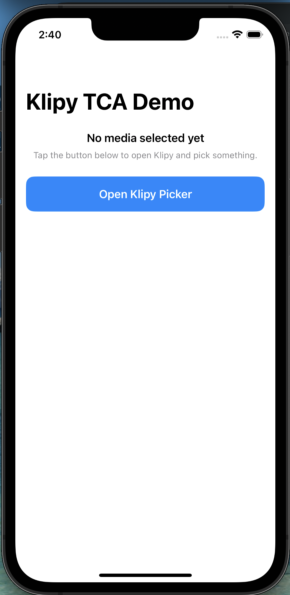
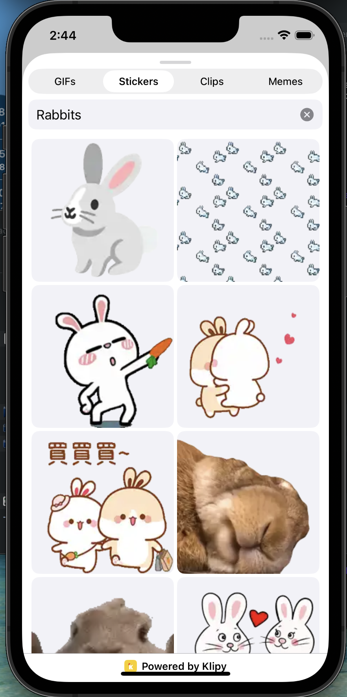
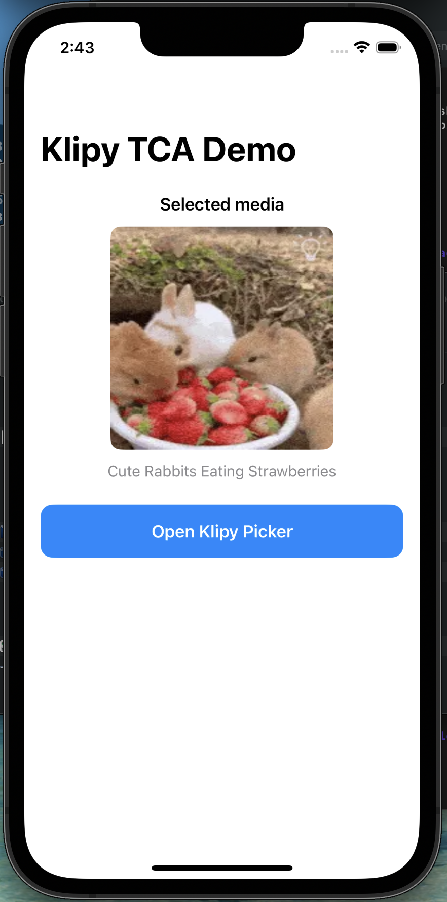

# Klipy iOS SDK


An unofficial Swift Package for integrating Klipy GIFs, stickers, clips, memes, and AI emojis into iOS apps.

This repository is not affiliated with, endorsed by, or owned by Klipy.

## Status

The production-ready surfaces in this repo today are:
- `KlipyCore`, which provides the typed async client, models, pagination, categories, item lookup, recent/share/report flows, and stable `customer_id` handling.
- `KlipyUI`, which provides callback-based SwiftUI and UIKit picker/grid surfaces with tabs, search, previews, infinite scrolling, configurable themes, locale overrides, and optional confirmation before selection.

`KlipyUI` and `KlipyTray` are built around The Composable Architecture for teams that want a consistent state-management model across picker, grid, and tray flows.
The main remaining release check is to run the live integration flows with your own Klipy API key and confirm the exact endpoint and content behavior you want in your environment.

The SDK also includes a tray-style accessory surface and is moving toward fuller controller-style integration points for teams that want parity with larger media SDKs.

## Products

- `KlipySDK`
  The primary install product for most apps. Includes `KlipyCore` and `KlipyUI`.
- `KlipyCore`
  The programmatic client and model layer.
- `KlipyUI`
  The SwiftUI picker layer. Re-exports `KlipyCore`.
- `KlipyTray`
  A tray-style picker experience for keyboard and message input surfaces.

## Requirements

- iOS 16+
- Swift Concurrency (`async` / `await`)
- Swift Package Manager or Xcode package integration

## Installation

### Xcode

1. Open **File -> Add Packages...**
2. Enter your repository URL, for example:

```text
https://github.com/Cortlandd/klipy-ios-sdk.git
```

3. Add `KlipySDK` for the default app-facing install path.
4. Add `KlipyCore` or `KlipyTray` separately only when you want those products explicitly.

### Package.swift

```swift
dependencies: [
    .package(url: "https://github.com/Cortlandd/klipy-ios-sdk.git", from: "1.3.0")
],
targets: [
    .target(
        name: "YourApp",
        dependencies: [
            .product(name: "KlipySDK", package: "klipy-ios-sdk")
        ]
    )
]
```

Most apps can simply:

```swift
import KlipyUI
```

## API Key Handling

The SDK needs a Klipy API key, but your integration should still avoid checking a live key into source control.

- For local development and the example apps, set `KLIPY_API_KEY` in **Scheme -> Edit Scheme -> Run -> Arguments -> Environment Variables**.
- If you prefer build settings, define a `KLIPY_API_KEY` user-defined build setting in your app target or in an untracked local `.xcconfig`. The example apps already map that build setting into the app's `Info.plist`.
- Create `KlipyConfiguration` or `KlipyClient.live(apiKey:)` at your app's composition boundary, then inject the client where your UI or features need it.
- Treat a shipped iOS key as an app credential, not a secret. Anything embedded in a client app can be recovered, so use app-specific keys, keep them out of git, and rotate them if they leak or if you need to narrow access.
- Content requests use a browser-like mobile `User-Agent` so Klipy can return ad inventory correctly, and the SDK also sends `X-Klipy-Client: klipy-ios-sdk/1.3.0 (iOS; community SDK)` so traffic still identifies itself as coming from this community-maintained iOS package.
- Ads can appear inline with normal media in trending, recent, and search feeds. The picker and tray render those ad entries automatically when Klipy returns them.

## Quick Start

### Programmatic client

```swift
import KlipyCore

let client = KlipyClient.live(apiKey: "<YOUR_KLIPY_API_KEY>")
let page = try await client.searchGIFs(
    query: "excited",
    page: 1,
    perPage: 24,
    locale: "en-US"
)

print(page.data.first?.slug ?? "No results")
```

### SwiftUI picker

```swift
import SwiftUI
import KlipyUI

struct ChatView: View {
    @State private var isShowingPicker = false
    @State private var selectedMedia: KlipyMedia?

    private let client = KlipyClient.live(apiKey: "<YOUR_KLIPY_API_KEY>")

    var body: some View {
        VStack(spacing: 16) {
            if let selectedMedia {
                KlipyMediaPreviewView(media: selectedMedia)
            }

            Button("Open Klipy Picker") {
                isShowingPicker = true
            }
            .buttonStyle(.borderedProminent)
        }
        .sheet(isPresented: $isShowingPicker) {
            KlipyPickerView(
                client: client,
                config: KlipyPickerConfig(
                    mediaTabs: [.gifs, .stickers, .clips],
                    maxItemsPerRow: 3,
                    showRecents: false,
                    showTrending: true,
                    initialTab: .gifs
                ),
                onSelect: { media in
                    selectedMedia = media
                    isShowingPicker = false
                },
                onClose: {
                    isShowingPicker = false
                }
            )
        }
    }
}
```

`KlipyPickerConfig` controls which tabs are shown, how dense the feed is, and which empty-query feed the picker uses. `maxItemsPerRow` tunes the masonry feed without forcing a strict column grid. If `initialTab` is not included in `mediaTabs`, the picker falls back to the first available tab. If both `showTrending` and `showRecents` are `false`, the picker waits for a search before loading results.
If the device is offline and the picker has no loaded content yet, it automatically shows a retryable offline state instead of the generic error view.

### Picker configuration

```swift
let config = KlipyPickerConfig(
    mediaTabs: [.gifs, .stickers, .clips],
    maxItemsPerRow: 3,
    locale: "en-US",
    showRecents: false,
    showTrending: true,
    initialTab: .gifs,
    showConfirmationScreen: true,
    theme: .darkBlur
)
```

Use `locale` when you want the picker to fetch content with an explicit locale instead of relying on the app's current device locale. Set `showConfirmationScreen` when you want the picker to present a lightweight review screen before selection is handed back to your app.
The picker state, search debouncing, pagination, offline handling, and mixed media/ad feed behavior are all driven by an internal TCA feature so SwiftUI and UIKit entry points stay in sync.

### TCA-backed picker integration

```swift
import SwiftUI
import ComposableArchitecture
import KlipyUI

struct ChatPickerSheet: View {
    let store: StoreOf<KlipyPickerFeature>
    let onSelect: (KlipyMedia) -> Void
    let onClose: () -> Void

    init(client: KlipyClient, onSelect: @escaping (KlipyMedia) -> Void, onClose: @escaping () -> Void) {
        self.store = Store(
            initialState: KlipyPickerFeature.State(
                config: .init(
                    mediaTabs: [.gifs, .stickers, .clips, .emojis],
                    maxItemsPerRow: 3,
                    showTrending: true,
                    showRecents: false,
                    showConfirmationScreen: true,
                    theme: .darkBlur
                )
            )
        ) {
            KlipyPickerFeature(client: client)
        }
        self.onSelect = onSelect
        self.onClose = onClose
    }

    var body: some View {
        KlipyPickerView(
            store: store,
            onSelect: onSelect,
            onClose: onClose
        )
    }
}
```

Use `KlipyPickerFeature` directly when your app already uses TCA and you want the picker's search, paging, offline, and ad-aware feed state to live in a reducer-driven flow from the start.

`KlipyTheme` supports:
- `.automatic`
- `.light`
- `.dark`
- `.lightBlur`
- `.darkBlur`

### UIKit picker controller

```swift
import UIKit
import KlipyUI

final class ChatHostViewController: UIViewController, KlipyPickerViewControllerDelegate {
    private let client = KlipyClient.live(apiKey: "<YOUR_KLIPY_API_KEY>")

    func openPicker() {
        let controller = KlipyPickerViewController(
            client: client,
            config: .init(
                mediaTabs: [.gifs, .stickers, .clips],
                maxItemsPerRow: 3,
                showConfirmationScreen: true,
                theme: .darkBlur
            )
        )
        controller.delegate = self
        present(controller, animated: true)
    }

    func klipyPickerViewController(_ controller: KlipyPickerViewController, didSelect media: KlipyMedia) {
        print("Selected media: \\(media.slug)")
    }

    func klipyPickerViewControllerDidClose(_ controller: KlipyPickerViewController) {}
}
```

Use `dismissesAfterSelection` or `dismissesAfterClose` when your app wants to manage presentation explicitly instead of letting the controller dismiss itself.

### UIKit media view

```swift
import UIKit
import KlipyUI

let mediaView = KlipyMediaView()
mediaView.cornerRadius = 12
mediaView.configure(with: media)
```

`KlipyMediaView` gives UIKit screens a reusable display primitive for showing a selected GIF, sticker, meme, emoji, or clip without embedding SwiftUI themselves.

### Embeddable grid controller

```swift
import UIKit
import KlipyUI

final class SearchResultsViewController: UIViewController, KlipyGridControllerDelegate {
    private let client = KlipyClient.live(apiKey: "<YOUR_KLIPY_API_KEY>")
    private lazy var gridController = KlipyGridController(
        client: client,
        content: .trending(kind: .gif, locale: "en-US"),
        configuration: .init(maxItemsPerRow: 3, theme: .automatic)
    )

    override func viewDidLoad() {
        super.viewDidLoad()
        gridController.delegate = self

        addChild(gridController)
        gridController.view.translatesAutoresizingMaskIntoConstraints = false
        view.addSubview(gridController.view)
        NSLayoutConstraint.activate([
            gridController.view.leadingAnchor.constraint(equalTo: view.leadingAnchor),
            gridController.view.trailingAnchor.constraint(equalTo: view.trailingAnchor),
            gridController.view.topAnchor.constraint(equalTo: view.topAnchor),
            gridController.view.bottomAnchor.constraint(equalTo: view.bottomAnchor),
        ])
        gridController.didMove(toParent: self)
    }

    func search(for query: String) {
        gridController.setContent(.search(kind: .gif, query: query, locale: "en-US"))
    }

    func klipyGridController(_ controller: KlipyGridController, didSelect media: KlipyMedia) {
        print("Picked media from grid: \\(media.slug)")
    }
}
```

Use `KlipyGridController` when your app already owns its own search field, tabs, or navigation shell and only needs Klipy’s feed rendering, pagination, and ad-aware mixed-content parsing.
Like the picker, the grid controller hosts the same TCA-backed loading, paging, offline, and ad-aware feed logic under the hood.

### Tray integration

```swift
import SwiftUI
import KlipyTray

struct ChatTrayHost: View {
    private let client = KlipyClient.live(apiKey: "<YOUR_KLIPY_API_KEY>")

    var body: some View {
        KlipyTrayView(
            client: client,
            config: .init(
                mediaTabs: [.gifs, .clips, .stickers],
                initialTab: .gifs,
                maxItemsPerRow: 3,
                locale: "en-US",
                showTrending: true,
                showRecents: false,
                showCategories: true,
                showSearch: true,
                theme: .dark
            )
        ) { media in
            print("Selected media: \(media.slug)")
        }
    }
}
```

`KlipyTrayView` uses the same retryable offline state when the tray cannot reach Klipy and does not have any loaded media yet. `KlipyTrayConfig` supports the same locale and theme controls as the standalone picker so the two surfaces can stay consistent inside the same app.

## Screenshots

| Default State        | Search Screen          | GIF Results            | Sticker Results        | Clip Results           | Displaying Selection   |
|----------------------|------------------------|------------------------|------------------------|------------------------|------------------------|
|  |  |  |  |  |  |

## Verification

The package currently includes:
- request and parameter validation tests for `KlipyCore`
- POST route coverage for share and recent-removal flows
- picker view-model tests for tab changes and debounced search behavior

GitHub Actions now validates the production install surface by building:
- `KlipySDK-Package`
- `KlipyChatUIKit`
- `KlipyChatTCA`

You can run the same build verification locally with:

```bash
./scripts/verify-ios-builds.sh
```

The live endpoint integration tests are opt-in and skip automatically unless `KLIPY_LIVE_API_KEY` is present in the test environment.

## Key Modules

- `Sources/KlipyCore`
  Core networking, models, pagination, categories, and typed endpoint helpers.
- `Sources/KlipyUI`
  SwiftUI picker, media preview helpers, and UI bootstrap code.
- `Sources/KlipyTray`
  Tray-specific configuration and TCA-powered tray surface.

## License

This repository is distributed under Apache License 2.0.
